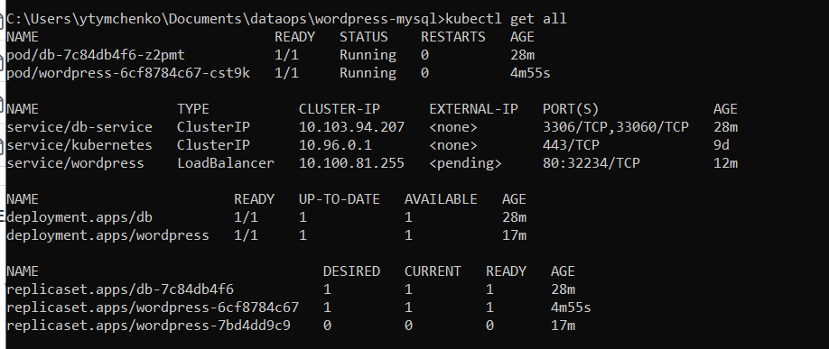
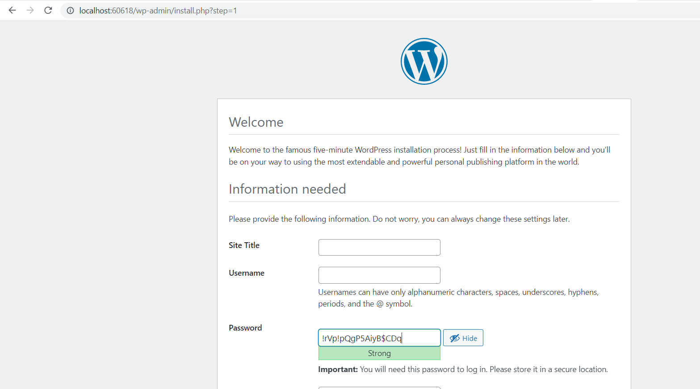

# Wordpress-sql kubernetes homework

### Task:
Take any docker-compose application consisting of UI and backend database (for example,
Prometheus+Grafana) and convert it to set of Kubernetes objects. 

#### [Used compose file](https://github.com/docker/awesome-compose/tree/master/wordpress-mysql)

### Screenshot of the running services:  

### Browser screenshot of working service and connection established

